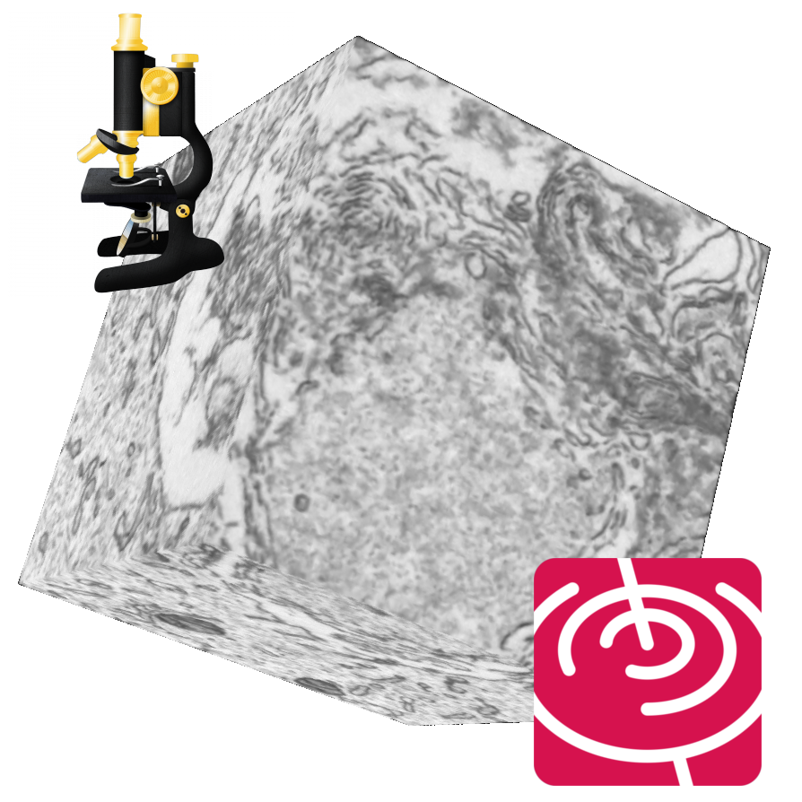

[Home](index) - [Research](research) - [Software](software) - [Workshops](workshops) - [Contact](contact)

# Software

This is a list of the software tools that I have developed together with various collaborators. 

## NeuralNets

NeuralNets is a [PyTorch](https://pytorch.org/) based utility library designed to quickly prototype with deep learning models for image segmentation of volumetric datasets. It offers data preprocessing and GPU accelerated augmentation, 2D/3D U-Net training and finetuning, block-based segmentation of large-scale volumes, segmentation visualization, etc. 

- [Github](https://github.com/JorisRoels/neuralnets)

## DenoisEM

{:height="100%" width="100%"}

DenoisEM is a GPU accelerated, interactive ImageJ plugin that allows for fast and advanced image denoising of large-scale 3D datasets. It offers state-of-the-art algorithms, user-interactive parameter optimization, fast denoising of large-scale volumes and scalable and reproducible processing. DenoisEM is a collaborative project between the [Saeys lab](https://vib.be/labs/yvan-saeys-lab) and [Bioinformatics Core](https://vib.be/labs/vib-bioinformatics-core) at VIB and the [IPI](https://ipi.ugent.be/) research group. 

- [Project page](https://bioimagingcore.be/DenoisEM/)
- [Github](https://github.com/vibbits/EMDenoising)
- Reference: Roels, J., Vernaillen, F., Kremer, A., Gonçalves, A., Aelterman, J., Luong, H. Q., Goossens, B., Philips, W., Lippens, S., & Saeys, Y. (2020). An interactive ImageJ plugin for semi-automated image denoising in electron microscopy. Nature Communications, 11(1), 1–13. <https://doi.org/10.1038/s41467-020-14529-0>
